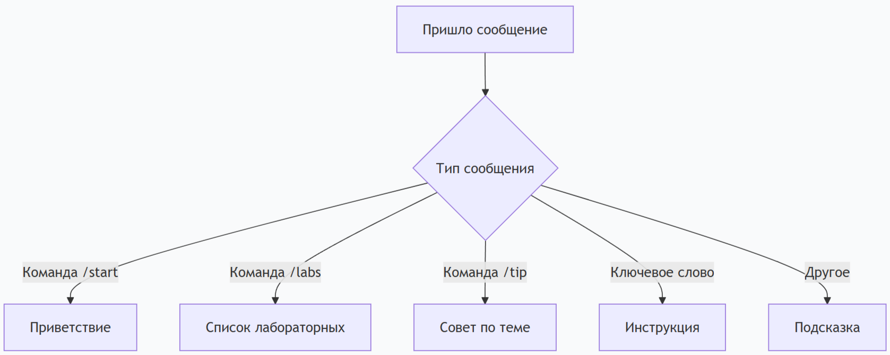
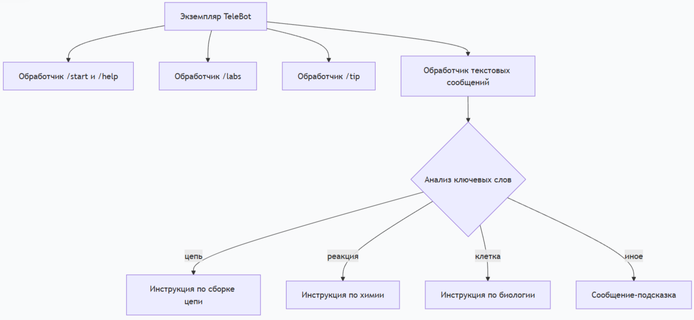

# Исследование и техническое руководство по созданию Telegram-бота на Python

## 1. Исследование технологии: Telegram-бот на Python

### 1.1. Актуальность

Telegram-боты представляют собой востребованный инструмент автоматизации, позволяющий организовать взаимодействие с пользователями без разработки отдельного мобильного приложения. В рамках проекта «Виртуальная лаборатория» создание бота-ассистента решает задачу оперативного предоставления справочной информации по лабораторным работам. Бот может давать советы по выполнению лабораторных работ по физике, химии и биологии, а также предоставлять список доступных работ.

### 1.2. Анализ существующих решений

Для создания Telegram-ботов на языке Python существует несколько библиотек. В таблице 1 представлен сравнительный анализ наиболее популярных из них.

**Таблица 1 – Сравнение библиотек для создания Telegram-ботов**

| Библиотека | Сложность | Тип | Рекомендация |
|------------|-----------|-----|---------------|
| python-telegram-bot | Высокая | Синхронная/Асинхронная | Для крупных проектов |
| pyTelegramBotAPI | Низкая | Синхронная | Для начинающих и малых проектов |
| aiogram | Средняя | Асинхронная | Для высоконагруженных систем |

В рамках данного проекта была выбрана библиотека `pyTelegramBotAPI` (также известная как `telebot`). Выбор обоснован следующими критериями:
- Простота освоения и минимальный порог входа.
- Наличие понятной официальной документации.
- Достаточный набор функций для реализации поставленных задач.

### 1.3. Принцип работы Telegram-бота

Взаимодействие между пользователем, Telegram и скриптом бота может быть представлено следующей последовательностью действий:

1. Пользователь отправляет сообщение (текст или команду) боту в Telegram.
2. Сервер Telegram принимает сообщение и перенаправляет его на сервер, где запущен скрипт бота (через Long Polling или Webhook).
3. Скрипт обрабатывает полученное сообщение в соответствии с заложенной логикой.
4. Сформированный ответ отправляется обратно в Telegram API.
5. Пользователь видит ответ бота в чате.


*Рисунок 1 – Схема взаимодействия клиент-сервер*


*Рисунок 2 – Структура обработчиков сообщений*


### 1.4. Этапы создания технологии

Последовательность создания Telegram-бота включала следующие шаги:

| № | Этап | Результат |
|---|------|-----------|
| 1 | Регистрация бота у BotFather | Получен токен доступа |
| 2 | Установка библиотек | Установлены telebot и requests |
| 3 | Написание базового кода | Бот отвечает на /start |
| 4 | Добавление команд | Бот отвечает на /labs и /tip |
| 5 | Добавление обработки ключевых слов | Бот реагирует на слова «цепь», «реакция», «клетка» |
| 6 | Тестирование и отладка | Все функции работают корректно |
| 7 | Модификация | Бот интегрирован с проектом «Виртуальная лаборатория» |

### 1.5. Вывод по исследованию

Исследование показало, что создание бота не требует сложной инфраструктуры. Бот может быть создан за несколько часов при наличии базовых знаний Python.

## 2. Техническое руководство по созданию Telegram-бота (для начинающих)

### Цель руководства

Данное руководство предназначено для начинающих разработчиков и описывает процесс создания простого Telegram-бота на языке Python.

### 2.1. Требования

- Python версии 3.10 или выше
- Аккаунт в Telegram
- Командная строка (терминал)

### 2.2. Пошаговая инструкция

#### Шаг 1. Установка Python

1. Загрузить дистрибутив Python с официального сайта python.org.
2. В процессе установки обязательно отметить опцию «Add Python to PATH».
3. После завершения установки открыть командную строку (Windows: Win + R, ввести `cmd`).
4. Выполнить команды для установки библиотек:

#### Шаг 2. Установка библиотек

Открыть командную строку и выполнить:

```bash
pip install pyTelegramBotAPI
pip install requests
```

#### Шаг 3. Создание бота в Telegram

1. Найти в Telegram бота @BotFather
2. Отправить команду `/newbot`
3. Указать имя бота
4. Указать username бота (должен заканчиваться на `_bot`)
5. Сохранить полученный токен


#### Шаг 4. Создание файла bot.py

Создать файл `bot.py` и открыть его в любом текстовом редакторе.

#### Шаг 5. Базовый код

Вставить в `bot.py` следующий код:

```python
import telebot

TOKEN = "токен_который_выдал_BotFather"
bot = telebot.TeleBot(TOKEN)

@bot.message_handler(commands=['start'])
def send_welcome(message):
    bot.reply_to(message, "Привет! Я бот-помощник по лабораторным работам.")

bot.infinity_polling()
```

#### Шаг 6. Запуск бота

В командной строке перейти в папку с файлом `bot.py` и выполнить:

```bash
python bot.py
```

#### Шаг 7. Добавление команды /labs

Добавить в файл `bot.py` следующий код перед строкой `bot.infinity_polling()`:

```python
@bot.message_handler(commands=['labs'])
def list_labs(message):
    text = "Лабораторные работы:\n1. Сборка электрической цепи (физика)\n2. Скорость химической реакции (химия)\n3. Строение клетки (биология)"
    bot.reply_to(message, text)
```

#### Шаг 8. Добавление команды /tip

Добавить обработчик команды `/tip`:

```python
lab_tips = {
    "физика": "Проверь правильность сборки цепи и надёжность контактов.",
    "химия": "Строго соблюдай пропорции реагентов и технику безопасности.",
    "биология": "Внимательно фиксируй наблюдения, делай зарисовки."
}

@bot.message_handler(commands=['tip'])
def give_tip(message):
    args = message.text.split(maxsplit=1)
    if len(args) < 2:
        bot.reply_to(message, "Укажите тему: /tip физика")
        return
    topic = args[1].lower()
    if topic in lab_tips:
        bot.reply_to(message, lab_tips[topic])
    else:
        bot.reply_to(message, "Доступные темы: физика, химия, биология")
```

#### Шаг 9. Добавление обработки ключевых слов

Добавить обработчик, который реагирует на слова «цепь», «реакция», «клетка»:

```python
@bot.message_handler(func=lambda msg: True)
def handle_keywords(message):
    text = message.text.lower()
    if "цепь" in text:
        response = "Сборка цепи:\n1. Нарисуй схему\n2. Собирай от источника\n3. Проверь контакты"
    elif "реакция" in text or "скорость" in text:
        response = "Химическая реакция:\n1. Запиши температуру\n2. Добавляй реактив по каплям\n3. Фиксируй изменения"
    elif "клетка" in text or "микроскоп" in text:
        response = "Микроскоп:\n1. Начни с малого увеличения\n2. Сфокусируй\n3. Зарисуй увиденное"
    else:
        response = "Напиши: цепь, реакция или клетка. Или используй /tip"
    bot.reply_to(message, response)
```

#### Шаг 10. Финальный запуск
Сохранить файл и перезапустить бота (остановить Ctrl+C и снова python bot.py).


## 3. Модификация проекта (творческий пункт)
### 3.1. Исходный туториал
За основу взят туториал freeCodeCamp по созданию бота-гороскопа. Исходный бот запрашивал знак зодиака и дату, затем обращался к внешнему API за предсказанием.

### 3.2. Выполненные изменения
Внесены следующие модификации:

Что было в туториале	Что сделано в проекте
Гороскоп	Справочная информация по лабораторным работам
Обращение к внешнему API	Использование встроенного словаря Python
Один тип команд	Три типа: /labs, /tip, ключевые слова
Развлекательная функция	Образовательная функция

### 3.3. Добавленный функционал
Команда /labs – выводит список лабораторных работ.

Команда /tip [тема] – выводит совет по указанной теме.

Обработка ключевых слов – бот распознаёт слова «цепь», «реакция», «клетка» и выдаёт инструкции.

Обработка ошибок – при вводе несуществующей команды или темы бот подсказывает правильный формат.

### 3.4. Код модификации
Ниже представлен фрагмент кода, реализующий модификацию:

'''python
lab_tips = {
    "физика": "Проверь правильность сборки цепи и надёжность контактов.",
    "химия": "Строго соблюдай пропорции реагентов и технику безопасности.",
    "биология": "Внимательно фиксируй наблюдения, делай зарисовки."
}

@bot.message_handler(commands=['tip'])
def give_tip(message):
    args = message.text.split(maxsplit=1)
    if len(args) < 2:
        bot.reply_to(message, "Укажите тему: /tip физика")
        return
    topic = args[1].lower()
    if topic in lab_tips:
        bot.reply_to(message, lab_tips[topic])
    else:
        bot.reply_to(message, "Доступные темы: физика, химия, биология")
        '''
### 3.5. Обоснование модификации
Модификация сделала бота полезным для образовательного проекта «Виртуальная лаборатория». Вместо развлекательного функционала появился учебно-справочный, что соответствует целям проекта.

Иллюстрация 5 – Модификация: команда /tip в работе

(Вставить скриншот чата с ботом с командой /tip физика)

## 4. Видеопрезентация работы

Видеопрезентация демонстрирует цель, задачи, процесс создания и работу бота.

Файл с видеопрезентацией расположен в репозитории: `images/bot.mp4`

Прямая ссылка для просмотра: [bot.mp4](images/bot.mp4)

## 5. Документация в репозитории и на сайте

### 5.1. Файлы в репозитории

В Git-репозиторий добавлены следующие файлы:

| Файл | Назначение |
|------|------------|
| `bot.py` | Исходный код бота |
| `TELEGRAM_BOT_REPORT.md` | Настоящий документ |
| `images/chart.png` | Схема 1 |
| `images/chart_2.png` | Схема 2 |
| `images/botfather1.png` | Скриншот 1 |
| `images/botfather2.png` | Скриншот 2 |
| `images/bot1.png` | Скриншот 3 |
| `images/bot2.png` | Скриншот 4 |
| `images/bot3.png` | Скриншот 5 |
| `images/bot.mp4` | Видеопрезентация |

### 5.2. Страница на сайте

На сайте проекта создана отдельная страница `bot.html`, содержащая:

- Цели и задачи создания бота
- Список доступных команд
- Видео-демонстрацию работы
- Ссылку на бота в Telegram

Ссылка на страницу добавлена в навигационное меню всех страниц сайта.

## 6. Заключение
В ходе выполнения работы были полностью реализованы требования задания:

Проведено исследование предметной области и технологии создания Telegram-ботов.

Создано техническое руководство для начинающих с пошаговыми инструкциями и примерами кода.

Выполнена модификация исходного туториала под задачи проекта «Виртуальная лаборатория».

Записана видеопрезентация с демонстрацией работоспособного результата.

Вся документация размещена в Git-репозитории в формате Markdown и на сайте в формате HTML.

Разработанный бот доступен в Telegram по ссылке: https://t.me/VirtLabAssistant_bot